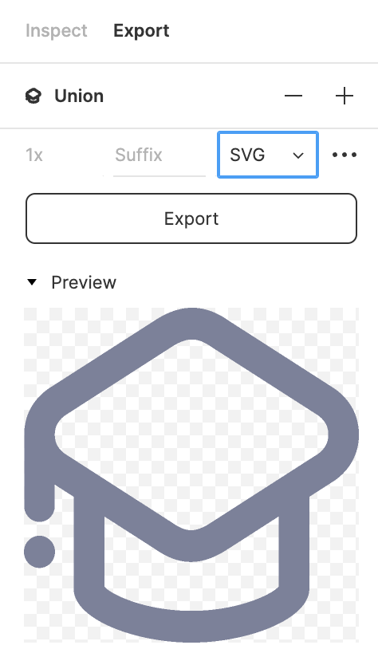
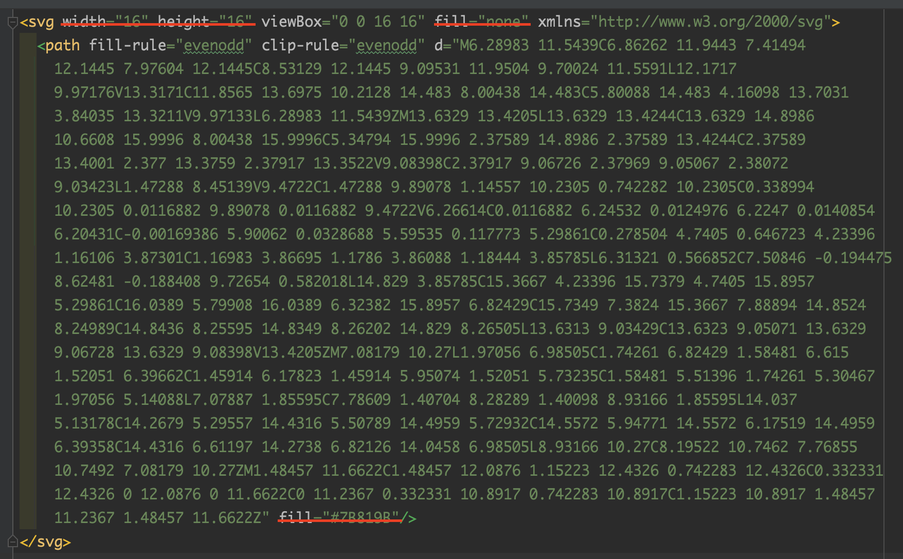

# Icon

- [Библиотека иконок](#library)
- [Добавление иконки](#adding)
- [Стилизация иконок](#styling)

<div id='library'/>

### Библиотека иконок

Все используемые в проекте иконки можно посмотреть в [`storybook` проекта][1]. Если необходимая 
иконка уже добавлена, то в повторном добавлении нет необходимости.

<div id='adding'/>

### Добавление иконки

Для работы с монотонными иконками служит компонент `Icon`.

1. Экспортируем иконку из `figma`



2. Помещаем иконку в папку `@/components/ui-kit/Icon/svg`
3. Очищаем иконку от размеров (`width` и `height`) и заливки (`fill`)



4. В файле `@/components/ui-kit/Icon/data.ts` импортируем иконку и добавляем ее в объект 
   `iconMap` в алфавитном порядке (для удобства корректировки при возникновении конфликтов)

```js
// ...
import { ReactComponent as union } from './svg/union.svg';

// Store each icon component in the map.
export const iconMap = {
  // ...
  // U
  // ...
  union,
  // ...
}
// ...
```

<div id='styling'/>

### Стилизация иконок

Очищенные иконки стилизуются с помощью `css` свойств `font-size` - размер иконки, `color` - цвет 
иконки

[1]: http://storybook.teacher.sitesoft.ru/?path=/story/icons-icons--default
